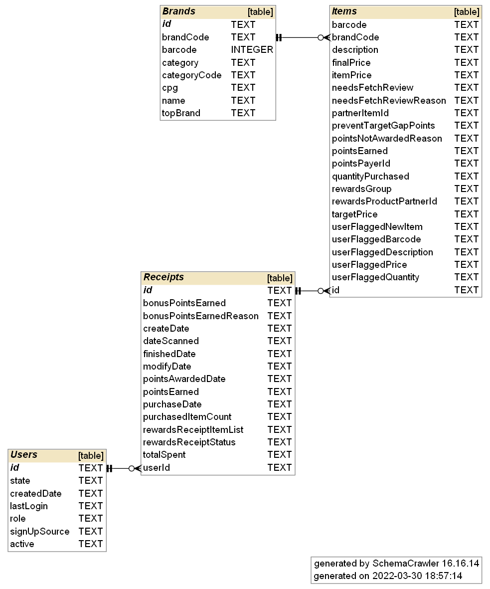

# Fetch DB

Work in support of the Fetch Rewards coding exercise for a data analyst role. The [requirements](https://fetch-hiring.s3.amazonaws.com/data-analyst/ineeddata-data-modeling/data-modeling.html) are outlined below with solutions provided.

While the task was to model a hypothetical database based on raw data files, I went ahead and created an sqlite database, `fetch.db`, so that I could run actual queries against it. The database was created with python through the script `create_db.py`.

## 1 Review Existing Data and Create Relational Data Model

I have included a schema picture of the sqlite database. The image was created with [SchemaCrawler](https://www.schemacrawler.com/). The command line code to produce the image is shown below.



```
schemacrawler \ 
--server sqlite \
--database fetch.db \
--info-level=maximum \
--password= \
--command schema \
--output-format png \
--output-file schema.png
```

## 2 Write a Query to Answer Predetermined Quesitons

I chose to answer the first two queries of:

> - What are the top 5 brands by receipts scanned for most recent month?
> - How does the ranking of the top 5 brands by receipts scanned for the recent month compare to the ranking for the previous month?

These are answered with the `receipts_explore.sql` file.

## 3 Evaluate Data Quality Issues in the Data

Many of the data quality issues I encountered were accounted for when creating the database. I tried to add comments in the file `create_db.py` as I came across them.

- The `users.json` data had many duplicate values in it that had to be removed
- The brandCode was used as a foreign key for the items table, which itself was a nested list from the receipts data. The brandCode was missing from many entries from that list. 
- Related to the above point, the items table, which holds data about specific products that were bought, contains a lot of missing data. Specifically there are many items that don't appear to get rewards or have been flagged for review. More context on these items or how the rewards program works would be helpful in dealing with these data.

## 4 Communicate With Stakeholders


> What questions do you have about the data?\
> How did you discover the data quality issues?\
> What do you need to know to resolve the data quality issues?\
> What other information would you need to help you optimize the data assets you're trying to create?\
> What performance and scaling concerns do you anticipate in production and how do you plan to address them?
